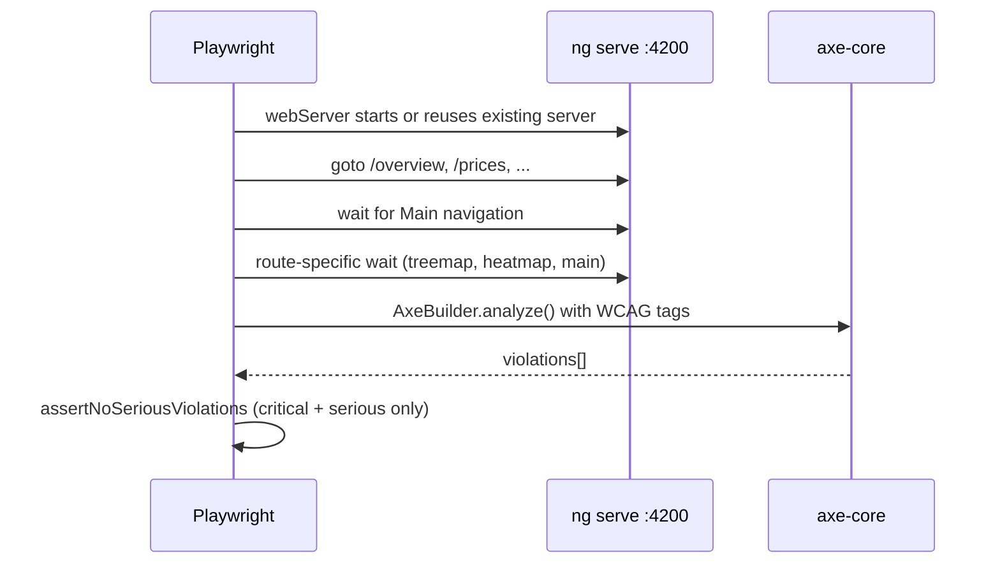

# Accessibility testing in Assetly

This document explains **why** automated accessibility testing was added, **where** each piece lives in the repo, and **how** to run and extend it.

**Roadmap / next steps:** [accessibility-plan.md](./accessibility-plan.md)

---

## Why we did this

### Business and product goals

- Assetly is a financial dashboard with tables, live prices, charts, and forms — all high-risk areas for accessibility failures.
- Project standards (`CLAUDE.md`, `todo.md` item 5) target **WCAG 2.2** quality and **zero critical/serious** automated violations over time.
- Manual testing alone does not catch regressions when UI changes ship frequently.

### Why this stack (not “Angular-native” E2E)

| Tool | Role | Why chosen |
|------|------|------------|
| **Playwright** | E2E browser runner | Industry default for new projects; stable, fast, good Angular support |
| **@axe-core/playwright** | Official axe adapter for Playwright | Maintained by Deque; pairs with Playwright |
| **axe-core** | Accessibility rule engine | Same engine used across the industry; powers the scans |
| **vitest-axe** | Vitest matchers + `axe()` helper | Works with Angular 21’s Vitest unit-test builder |

We intentionally **did not** use `axe-playwright` (older community wrapper; low npm adoption).

**Angular-native pieces** (`@angular/cdk/a11y`, semantic HTML, ARIA in templates) are for **building** accessible UI. **axe + Playwright/Vitest** are for **verifying** it automatically.

### Two layers on purpose

```text
┌─────────────────────────────────────────────────────────────┐
│  E2E (Playwright + @axe-core/playwright)                    │
│  Full page in real browser · routes · lazy-loaded features   │
└─────────────────────────────────────────────────────────────┘
┌─────────────────────────────────────────────────────────────┐
│  Component (*.a11y.spec.ts + vitest-axe)                    │
│  Isolated widgets · fast feedback · TestBed + jsdom          │
└─────────────────────────────────────────────────────────────┘
```

- **E2E** catches integration issues (layout, defer blocks, route-level landmarks).
- **Component** catches issues in one widget without navigating the whole app.

Both share the same **severity gate**: tests fail only on **critical** and **serious** axe impacts (moderate/minor can be fixed later).

---

## What was installed

Dev dependencies added to `package.json`:

```json
"@playwright/test": "^1.60.0",
"@axe-core/playwright": "^4.11.3",
"axe-core": "^4.12.0",
"vitest-axe": "^0.1.0"
```

Chromium for Playwright (one-time):

```bash
npx playwright install chromium
```

---

## Where everything lives

### New files

| Path | Purpose |
|------|---------|
| [`playwright.config.ts`](../playwright.config.ts) | Playwright project config, `webServer`, reporters, base URL |
| [`e2e/a11y/routes.spec.ts`](../e2e/a11y/routes.spec.ts) | One E2E test per main route; runs axe after page is ready |
| [`e2e/a11y/helpers/assert-no-serious-violations.ts`](../e2e/a11y/helpers/assert-no-serious-violations.ts) | Shared assertion: fail only on critical/serious violations |
| [`src/testing/vitest-axe-setup.ts`](../src/testing/vitest-axe-setup.ts) | Global Vitest setup: `import 'vitest-axe/extend-expect'` |
| [`src/testing/run-axe.ts`](../src/testing/run-axe.ts) | `runAxe(container)` + `assertNoSeriousViolations()` for component tests |
| [`src/app/shared/components/not-found/not-found.a11y.spec.ts`](../src/app/shared/components/not-found/not-found.a11y.spec.ts) | Starter component a11y test (minimal surface) |
| [`src/app/features/alerts/components/alert-builder/alert-builder.a11y.spec.ts`](../src/app/features/alerts/components/alert-builder/alert-builder.a11y.spec.ts) | High-value form UI with mocked services |

### Modified files

| Path | Change |
|------|--------|
| [`package.json`](../package.json) | New npm scripts: `e2e`, `e2e:a11y`, `e2e:ui`, `a11y:report`, `test:a11y` |
| [`angular.json`](../angular.json) | `test.options.setupFiles` → vitest-axe setup |
| [`tsconfig.spec.json`](../tsconfig.spec.json) | Include `src/testing/**/*.ts` |
| [`README.md`](../README.md) | How to run a11y tests |
| [`todo.md`](../todo.md) | Item 5 marked done for infra (expand coverage separately) |
| [`src/app/features/overview/overview.html`](../src/app/features/overview/overview.html) | Loading skeleton: `role="status"` (axe: `aria-label` on plain `div`) |
| [`src/app/features/price-feed/price-feed.html`](../src/app/features/price-feed/price-feed.html) | Same for heatmap loading skeleton |
| [`src/app/features/holdings/components/holdings-table/holdings-table.html`](../src/app/features/holdings/components/holdings-table/holdings-table.html) | Removed `role="link"` on `<tr>` (conflicted with `aria-rowindex`) |

### Already present (reused)

| Path | Note |
|------|------|
| [`.gitignore`](../.gitignore) | Already ignored `playwright-report/`, `test-results/`, `coverage/` |
| [`src/environments/environment.ts`](../src/environments/environment.ts) | `useMockData: true` — E2E runs without API keys |
| [`src/app/app.routes.ts`](../src/app/app.routes.ts) | Routes under test |

### Output artifacts (not committed)

- `playwright-report/` — HTML report after `npm run e2e:a11y`
- `test-results/` — Playwright traces/screenshots on failure

---

## How it works

### E2E flow



**Configuration** ([`playwright.config.ts`](../playwright.config.ts)):

- `baseURL`: `http://localhost:4200`
- `webServer`: `npm run start`, `reuseExistingServer: !CI` (reuses your running `ng serve` locally)
- Reporters: `list` + `html` (open via `npm run a11y:report`)
- Browser: Chromium only (faster CI/local runs)

**Routes scanned** (from [`app.routes.ts`](../src/app/app.routes.ts)):

| Route | Wait strategy |
|-------|----------------|
| `/overview` | `app-treemap` visible (avoids scanning `@loading` skeleton) |
| `/prices` | `app-sector-heatmap` visible |
| `/holdings` | Nav only |
| `/alerts` | Nav only |
| `/reports` | Nav only |
| `/chart/AAPL` | `main` visible; `AAPL` matches mock resolver default |

**Why we wait on nav, not `networkidle`:** `/prices` uses a WebSocket/mock stream that never goes idle; waiting on `networkidle` would hang or flake.

**WCAG tags** passed to axe:

`wcag2a`, `wcag2aa`, `wcag21aa`, `wcag22aa`

**Assertion** ([`assert-no-serious-violations.ts`](../e2e/a11y/helpers/assert-no-serious-violations.ts)):

- Filters violations where `impact` is `critical` or `serious`
- Prints rule id, help text, and selectors on failure

---

### Component (Vitest) flow

1. Angular `unit-test` builder loads [`vitest-axe-setup.ts`](../src/testing/vitest-axe-setup.ts) before specs (`angular.json` → `setupFiles`).
2. Each `*.a11y.spec.ts` uses `TestBed` + `provideZonelessChangeDetection()` (matches the app).
3. `runAxe(fixture.nativeElement)` runs axe in jsdom with the same WCAG tags.
4. `assertNoSeriousViolations(results)` applies the same gate as E2E.

**`not-found` spec:** No dependencies — baseline that the pipeline works.

**`alert-builder` spec:** Mocks injected so the form renders without live WebSocket/chart:

- `PriceFeedService` — `prices` signal, stub `seedHistory`
- `AlertValidatorService` — `validateSymbol` → `of({ valid: false })`
- `AlertEngineService` — no-op `evaluateNewAlert`

`AlertsStore` and real child templates still load; live panel stays hidden until symbol is valid.

**CLI note:** Angular 21 uses `ng test --watch=false`, not `--run`. Filtering uses `--include=**/*.a11y.spec.ts`.

---

## How to run

```bash
# Component accessibility only
npm run test:a11y

# All unit tests (includes *.a11y.spec.ts)
ng test --watch=false

# E2E accessibility (starts server if not running)
npm run e2e:a11y

# Open last Playwright HTML report
npm run a11y:report

# All Playwright tests / UI mode
npm run e2e
npm run e2e:ui
```

---

## Current test status

| Suite | Result (at time of setup) |
|-------|---------------------------|
| `npm run test:a11y` | **2/2 passed** (`not-found`, `alert-builder`) |
| `npm run e2e:a11y` | **5/6 passed** |

**Known failure:** `/overview` — **color-contrast** on treemap loss/gain leaves (dynamic inline colors from D3). Serious impact; needs treemap color scale or text styling fix, not a test harness change.

**Fixes already applied** so other routes pass:

1. Loading skeletons: `role="status"` so `aria-busy` / `aria-label` are valid on loading placeholders.
2. Holdings table: removed `role="link"` from `<tr>` so `aria-rowindex` is valid for table rows.

---

## How to add more coverage

### New E2E route

1. Add path to `routes` in [`e2e/a11y/routes.spec.ts`](../e2e/a11y/routes.spec.ts).
2. Add a stable `waitFor` for lazy/deferred content before `analyze()`.
3. Run `npm run e2e:a11y` and fix any critical/serious findings in templates/styles.

### New component test

1. Create `my-component.a11y.spec.ts` next to the component.
2. Configure `TestBed` with `provideZonelessChangeDetection()` and mocks for injected services.
3. `const results = await runAxe(fixture.nativeElement); assertNoSeriousViolations(results);`
4. Run `npm run test:a11y`.

### Naming convention

- E2E: `e2e/a11y/**/*.spec.ts`
- Unit/component: `**/*.a11y.spec.ts` (included by `tsconfig.spec.json` `**/*.spec.ts` pattern)

---

## What was explicitly out of scope

- GitHub Actions CI workflow (fail PR on serious/critical)
- ESLint `@angular-eslint/template-accessibility`
- `*.a11y.spec.ts` for every feature component
- Fixing all moderate/minor axe findings
- Full treemap contrast remediation (documented as follow-up)

---

## Relationship to manual testing

Automated axe does **not** replace:

- Keyboard-only journey testing (Tab, Enter, Space, Escape)
- Screen reader review (NVDA / VoiceOver)
- Chart keyboard crosshair behavior (`CLAUDE.md` patterns)

Use automation as a **regression gate**; use manual checks for UX and announcement quality.

---

## Quick reference: package roles

```text
playwright          → opens browser, navigates, waits
@axe-core/playwright → runs axe-core inside Playwright page
axe-core            → WCAG rules (violations, impact levels)
vitest-axe          → axe() + matchers in Vitest/jsdom
@angular/cdk/a11y   → (app code) FocusMonitor, LiveAnnouncer — not part of test runner
```

---

*Last updated: June 2026 — matches Playwright + @axe-core/playwright + vitest-axe setup in Assetly.*
